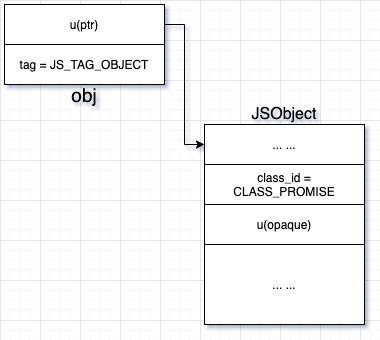
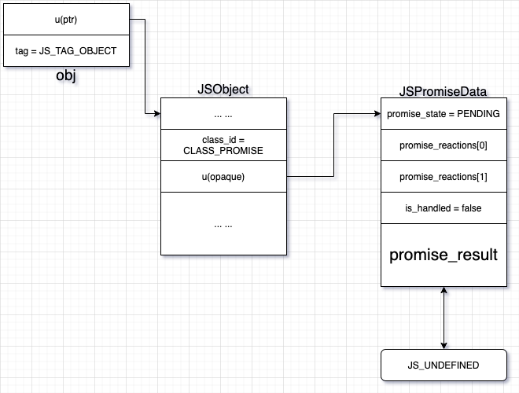
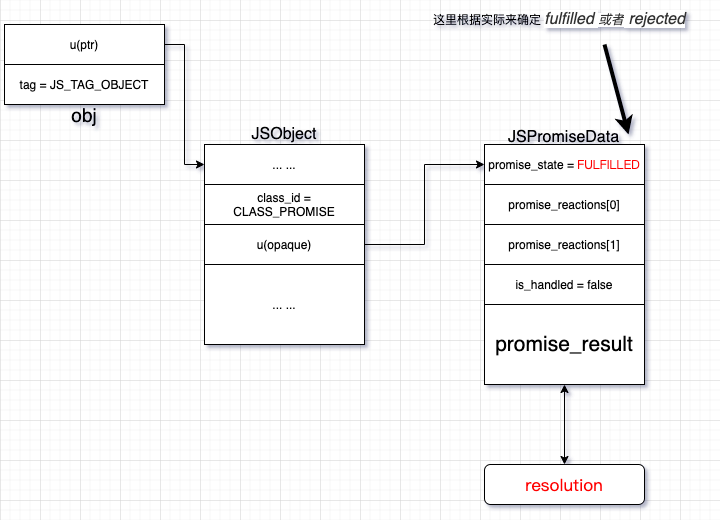
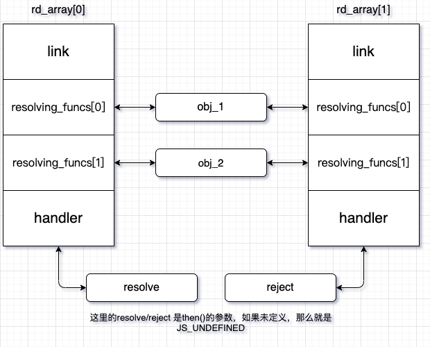
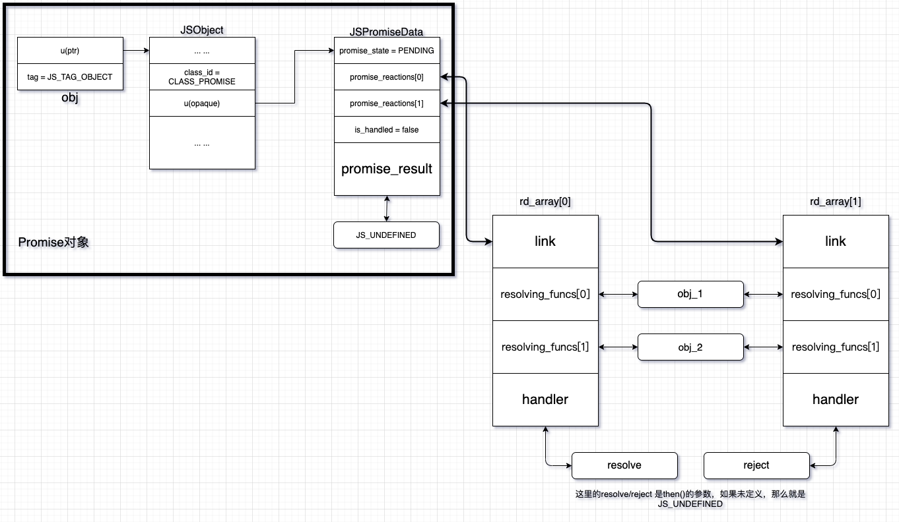
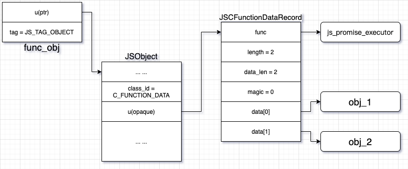
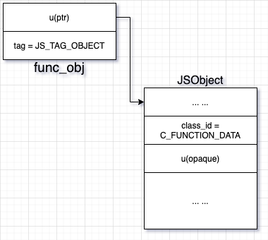
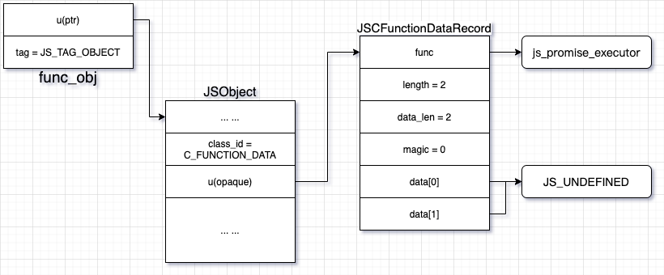
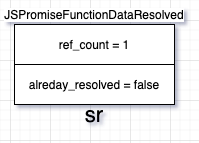
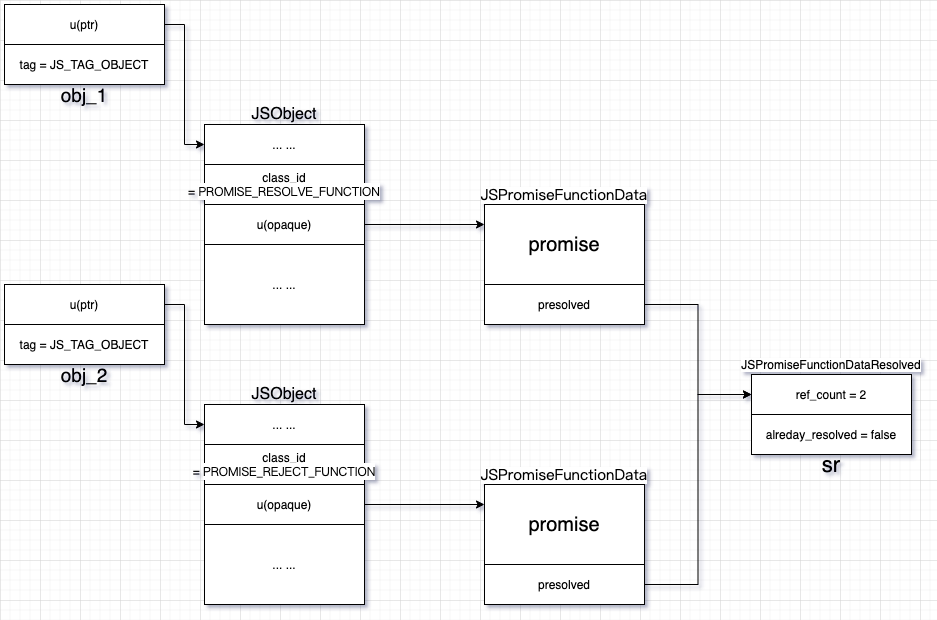

> 什么叫工作？工作就是斗争。那些地方有困难、有问题，需要我们去解决。我们是为着解决困难去工作、去斗争的。越是困难的地方越是要去，这才是好同志。

想要在短时间内完全厘清 **Promise** 是很困难的。  
我们可以从一个极小的方面入手，慢慢搞懂这其中的运作原理。  
### 一些准备工作
1. 带有c/c++调试环境的工具 在这里我使用的是 [vscode](https://code.visualstudio.com/) + [gdb](https://www.gnu.org/software/gdb/)
2. [QuickJS](https://bellard.org/quickjs/)  这是一个小型的javascript引擎，对于只是分析来讲，我想这已经够用了。如果你想挑战，也可以使用 [v8](https://v8.dev/)
3. **可以自由掌握时间**  

附加：如果你没有办法编译成功，或者无法调试，请尝试修改它的 **Makefile** 文件，比如打开 **CONFIG_WIN32**，或者关闭 **lpthread**，或者关闭 **O2优化** 等等  

### 从哪里开始  
既然只是了解 `Promise` 是如何实现的，那么就没有必要在无关的代码停留太多时间。  
就从 `js_promise_constructor` 开始
#### `js_promise_constructor`   
```c
static JSValue js_promise_constructor(JSContext *ctx, JSValueConst new_target,
                                      int argc, JSValueConst *argv)
```
这个函数的参数实际只包括两个：  
`new_target` 和 `executor`(`argv[0]`)。
1. `new_target` 我其实并不知道是什么，知道的麻烦告知我一下，可以提ISSUE。我猜测应该是上层的`function_object`。因为看调用堆栈，`new_target` 是从 `fun_obj` 拷贝过来的，指向同一个对象。
2. `executor` 就是 `Promise` 的参数  
这个函数总体的功能就是生成一个 `Promise` 对象，也就是对应的js代码:  
```javascript
let p = new Promise(executor)
```
该函数基本流程如下所述：
1. 创建一个 `Promise`对象 `obj`  

2. 构造并初始化`Promise`对象的运行时数据 `s`，类型为 [`JSPromiseData`](#jspromisedata)
3. 将`obj`中的不透明数据设置为 `s`，也就是将它们两个关联起来

4. 调用 [`js_create_resolving_functions`](#js_create_resolving_functions)，尝试构造两个 `resolve` `reject` 函数对象并赋值给 `args[0]` `args[1]`
5. 尝试执行 `executor`。  执行是复杂的，我们后面分成两部分来看
6. 一切正常返回 `obj`  
   
~~这个时候 上面js代码中的 `p` 就相当于这里的 `obj`~~

#### `executor` 是如何执行的
在这里之前，我们需要一个例子用来使过程更加清晰
```javascript
    let p = new Promise((resolve, reject)=> {
        resolve(1);
    })
```
```c
ret = JS_Call(ctx, executor, JS_UNDEFINED, 2, (JSValueConst *)args);  
```
这一步会把`executor` 和上面构造的 `resolve` `reject` 函数对象(`args[0]` `args[1]`)当做参数传入，中间会执行一系列的操作，
1. 没有异步操作时  
   没有异步操作，也就意味着可以直接决议这个 `promise` 。在`executor` 的函数指令中，会调用一个 `OP_tail_call` ，最终调用 `JS_CallInternal`
   ```c
   ret_val = JS_CallInternal(ctx, call_argv[-1], JS_UNDEFINED,
                                          JS_UNDEFINED, call_argc, call_argv, 0);
   ```
   这里`JS_CallInternal` 第二个参数 `call_argv[-1]` 取决于你首先调用了`resolve` `reject`中的哪一个, 倒数第二个参数就是 前面的参数。  
   按照举例来说，第二个参数就是 `resolve` 对象，也即前面构造好的 `args[0]` ，倒数第二个参数就是 数字1 。  
   简单来说，就是函数跟参数依次入栈，然后产生一次函数调用。

   `resolve`函数执行时发现（这是一个内部函数） 既不是 `C_FUNCTION` 也不是 `BOUND_FUNCTION`, 就会在一个函数表中查找真正需要调用的函数，然后就调用到真正我们需要的地方 ---- [`js_promise_resolve_function_call`](#js_promise_resolve_function_call) 
   ```c
    // ... ...
    p = JS_VALUE_GET_OBJ(func_obj);
    if (unlikely(p->class_id != JS_CLASS_BYTECODE_FUNCTION)) {
        switch(p->class_id) {
        case JS_CLASS_C_FUNCTION:
            // ... ...
        case JS_CLASS_BOUND_FUNCTION:
            // ... ...
        default:
            {
                JSClassCall *call_func;
                call_func = ctx->rt->class_array[p->class_id].call;
                // ... ...
                return call_func(ctx, func_obj, this_obj, argc,
                                 (JSValueConst *)argv);
            }
        }
    }
   ```
   
2. 异步操作时（以settimeout为例）
   ```c
   js_os_setTimeout(JSContext *ctx, JSValueConst this_val,
                                int argc, JSValueConst *argv)
   ```
   这个函数会把 settimeout 的两个参数(handler, time) 打包成一个time任务，等待后面 std_loop 中超时调度。
   在调度时就和同步操作时一致


#### `js_promise_resolve_function_call` 
```c
static JSValue js_promise_resolve_function_call(JSContext *ctx,
                                                JSValueConst func_obj,
                                                JSValueConst this_val,
                                                int argc, JSValueConst *argv)
```
参数 `func_obj` 就是 `resolved` `reject` 函数对象之一  
参数 `argv[0]` 就是js代码调用`resolved` `reject`时传入的参数 比如 `resolved(1)` 中的 1  
其执行过程如下所述：  
1. 首先会判断是否已经决议过了，如果已经决议过，那么直接返回 `JS_UNDEFINED`
2. 否则 设置状态 `already_resolved` 为已经决议
   ```c
    if (!s || s->presolved->already_resolved)
        return JS_UNDEFINED;
    s->presolved->already_resolved = TRUE;
   ```
   
3. 接着会判断 `promise` 是否被拒绝，也就是 js代码中是否首先调用了 `reject` ，如果是，那么就直接进入到 [`fulfill_or_reject_promise`](#fulfill_or_reject_promise) 函数中；否则会判断 `resolution`(`resolve(resolution)` 或者上文提到的 1) 是否是一个 `object` 如果不是也会进入到 [`fulfill_or_reject_promise`](#fulfill_or_reject_promise)
```c
if (is_reject || !JS_IsObject(resolution)) {
        goto done;
    } 
//    ... ....
    done:
        fulfill_or_reject_promise(ctx, s->promise, resolution, is_reject);
```
TODO:
4. 否则 根据 `then` 的状态决定是否加入到 runtime任务队列

#### `fulfill_or_reject_promise`
```c
static void fulfill_or_reject_promise(JSContext *ctx, JSValueConst promise,
                                      JSValueConst value, BOOL is_reject)
```
参数 `value` 就是 `promise` 的结果   
参数 `is_reject`是`promise`决议的状态 用来决定等待激活的任务队列

这个函数比较简单，首先设置 `promise` 的结果跟状态，然后查看该状态下是否有等待激活的任务，如果有，那么就把它们加入到 `runtime` 的运行队列。


TODO: 小结


#### `js_promise_then`
这个函数就是实现的 `Promise.prototype.then` 功能
```javascript
// let p = new Promise(executor)
p.then(handleFulfilled, handleRejected)
```
其基本功能如下所述：
1. 获得 `this` 的 species构造函数 `ctor`
2. 创建 `then()` 需要返回的 结果promise `promise_result`
3. 执行 [`perform_promise_then`](#perform_promise_then)
4. 返回 `promise_result`


#### `perform_promise_then`
```c
static __exception int perform_promise_then(JSContext *ctx,
                                            JSValueConst promise,
                                            JSValueConst *resolve_reject,
                                            JSValueConst *cap_resolving_funcs)
```
```javascript
// e.g. 
let p = new Promise(executor)
let q = p.then(...)
```
参数 `promise` 指的是例子中的的 `p`  
`resolve_reject` 是 `then()` 的参数  
`cap_resolving_funcs` 是 `then()` 返回的`promise` (q) 中需要决议的两个函数对象 `resolve`(obj_1) `reject`(obj_2)  
1. 首先初始化两个 [`JSPromiseReactionData`](#jspromisereactiondata) 对象 `rd_array[0]` `rd_array[1]` 全部设置完毕后结构如图所示：

2. 然后如果`promise`(`p`) 的状态是 `PENDING`，那么就将 rd_array 挂载到`promise` 的 `promise_reactions` 队列中，等待某次激活
   
3. 否则 根据`promise` 的状态 选择对应的 rd_array 将其加入到 runtime的运行队列
```c
    JSValueConst args[5];
    i = s->promise_state - JS_PROMISE_FULFILLED;
    rd = rd_array[i];
    args[0] = rd->resolving_funcs[0];
    args[1] = rd->resolving_funcs[1];
    args[2] = rd->handler;
    args[3] = JS_NewBool(ctx, i);
    args[4] = s->promise_result;
    JS_EnqueueJob(ctx, promise_reaction_job, 5, args);
```


#### `js_new_promise_capability`
1. 首先调用 [`js_promise_executor_new`](#js_promise_executor_new) 创建一个 `executor`
2. 然后判断 `ctor` 是否未定义  
   是，那么就调用 [`js_promise_constructor`](#js_promise_constructor)   
   否则 调用 `JS_CallConstructor`。这里经过一系列转换后，最终也会调用到[`js_promise_constructor`](#js_promise_constructor)  
   ```c 
   // ... ...
    if (JS_IsUndefined(ctor)) {
    result_promise = js_promise_constructor(ctx, ctor, 1,
                                            (JSValueConst *)&executor);
    } else {
        result_promise = JS_CallConstructor(ctx, ctor, 1,
                                            (JSValueConst *)&executor);
    }
    // ... ...
   ```
   前面提到，在 `js_promise_constructor` 中有一步会执行 `executor`。在这里执行`executor`时 ，最终函数会调用到 `js_promise_executor`。这是第一步`js_promise_executor_new`中设置好的     
   这个函数比较简单，它的作用就是 将 `s` 中的 `data[0]` `data[1]` 设置成 `js_promise_constructor` 中第4步 `js_create_resolving_functions` 创建好的两个函数对象 `resolve` `reject`    
   所以执行完 `executor` 后，`executor`就变成这样：  
     
   并且返回一个 `result_promise`，这时 `obj_1`(`resolve`) `obj_2`(`reject`) 中的`promise` 也是这个 `result_promise` 
3. 将函数对象 `resolve` `reject` 和 `result_promise` 全部返回


#### `js_promise_executor_new` 
顾名思义，该函数会创建一个 `executor`，其真正调用的是 [`JS_NewCFunctionData`](#js_newcfunctiondata) 这个函数
```c
    return JS_NewCFunctionData(ctx, js_promise_executor, 2,
                               0, 2, func_data);
```
#### `JS_NewCFunctionData`
1. 首先创建一个 `func_obj`  

2. 初始化好一个 `JSCFunctionDataRecord` 结构: `s`，然后设置 `func_obj` 的不透明域为 `s`   
`s->func` 指向了 `js_promise_executor` 这个函数，它会在 `js_promise_constructor` 中执行 `executor` 时调用到。

3. 定义其属性  


#### `js_create_resolving_functions`
```c
static int js_create_resolving_functions(JSContext *ctx,
                                         JSValue *resolving_funcs,
                                         JSValueConst promise)
```

1. 创建一个[`JSPromiseFunctionDataResolved`](#jspromisefunctiondataresolved) 结构 `sr`
   
2. 创建两个 `obj` 并且设置好它们的数据 `JSPromiseFunctionData` 
3. 每个 `presolved` 都指向 `sr`
   

#### [`js_std_loop`]
```c
for(;;) {
        /* execute the pending jobs */
        for(;;) {
            err = JS_ExecutePendingJob(JS_GetRuntime(ctx), &ctx1);
            if (err <= 0) {
                if (err < 0) {
                    js_std_dump_error(ctx1);
                }
                break;
            }
        }

        if (!os_poll_func || os_poll_func(ctx))
            break;
    }
```
这个函数比较简单，首先尝试执行所有peding中的任务，如果任务队列为空就跳出；然后看是否定义了自定义的 `os_poll_func`
函数，如果定义了就去执行一次 `os_poll_func` 
在windows中
首先检查 `ts->os_timers` 中是否含有超时的任务，如果有，就去执行这个任务，然后返回； 否则检查是否有io任务，如果有就去执行一个，然后返回；全都没有，sleep()上面统计的一个最小延时。
TIPS: 这里可以和其他的网络库连接起来，比如libevent，把这里的加队列和唤醒机制放到libevent中去处理。


### 部分结构参考  

#### [`JSPromiseData`]
```c
typedef struct JSPromiseData {
    // promise状态 包括 pending fuifilled rejected
    JSPromiseStateEnum promise_state; 
    // 挂起的待决议函数
    struct list_head promise_reactions[2];
    // promise决议的结果
    JSValue promise_result;
} JSPromiseData;
```
#### [`JSPromiseReactionData`]
```c
typedef struct JSPromiseReactionData {
    struct list_head link; /* not used in promise_reaction_job */
    JSValue resolving_funcs[2];
    // handler 是指 then() 两个参数之一，在 promise确定状态时会调用
    JSValue handler;
} JSPromiseReactionData;
```
#### [`JSPromiseFunctionDataResolved`]
```c
typedef struct JSPromiseFunctionDataResolved {
    // 引用次数
    int ref_count;
    // 是否已经决议过
    BOOL already_resolved;
} JSPromiseFunctionDataResolved;
```

#### [`JSCFunctionDataRecord`]
```c
typedef struct JSCFunctionDataRecord {
    // 一个函数指针，指向一个内部函数(e.g. `js_promise_executor`)
    JSCFunctionData *func;
    // TODO:
    uint8_t length;
    // data 域的长度
    uint8_t data_len;
    uint16_t magic;
    JSValue data[0];
} JSCFunctionDataRecord;
```