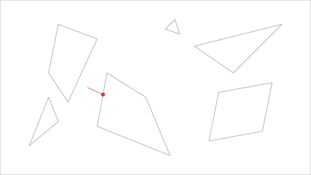
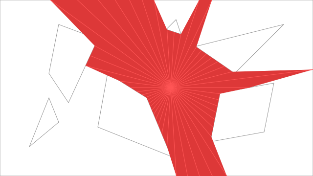
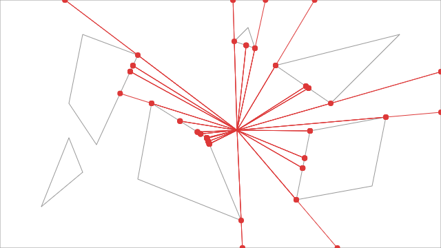
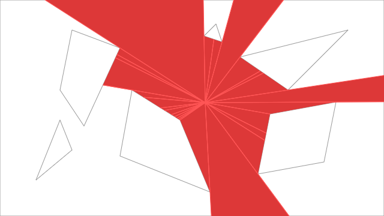

>  空空如也 有的时候也指脑子

### 前言
最一开始是看 [roguelike](http://www.roguebasin.com/index.php/Articles) 系列，有点好奇是怎么实现的，就在这里记录下。
全文参考了[2d-fov](https://legends2k.github.io/2d-fov/design.html)和[sight-and-light](https://github.com/ncase/sight-and-light)。  
(强力推荐第二个github，第一篇文章比较偏理论型)

-----
首先考虑最简单的模型，检测**一条射线与一条线段**相交。  
一种常用的判定方法是用二者的参数方程。  

线段的两个顶点 A$(x_0, y_0)$ B$(x_1, y_1)$
$$ \begin{cases}
    x_{segment} = x_0 + (x_1 - x_0) t_1 \\
    y_{segment} = y_0 + (y_1 - y_0) t_1 \\
\end{cases}
(0 < t_1 < 1)
$$

射线的一个顶点C$(x_2, y_2)$ 另外一个点D$(x_3, y_3)$ 可以取射线上的任意一点
$$ \begin{cases}
    x_{ray} = x_2 + (x_3 - x_2) t_2 \\
    y_{ray} = y_2 + (y_3 - y_2) t_2 \\
\end{cases}
(t_2 > 0)
$$
二者相交的条件就是 
$$ 
\begin{cases}
    x_{segment} = x_{ray} \\
    y_{segment} = y_{ray} \\
\end{cases}
$$
方程联立解出有效的$t_1$, $t_2$，那么就可以说明射线与线段相交了。  

----
一个简单的模型，2d地图是由多个多边形组成，也就是多条**线段**。   
当只有一条**射线**时，只需要检测这条**射线**与每条**线段**是否发生碰撞即可。  
当然，当在某个方向上**射线**存在多个交点时，我们只需要保留$t_2$最小的那个交点即可。

然后我们可以通过检测***多个方向***的射线与地图多边形的交点，将这些交点顺次连接就组成了一个最简单的可见区域。

这里的***多个方向***仅仅是一种概念，实际上一般是通过检测射线与多边形的各个**顶点**是否具有交点来判断。  
但是仅仅检测多边形的交点会有一个问题：当射线产生交点的时候，射线不会延续下去，这样产生的区域不会完整。

一种解决的方案是**射线在与多边形检测交点的时候，额外使用偏移一定角度的两条射线**，从而判断出交点外的可见区域。

这样最终交点构成的多边形就是一个完整的可见区域。

----
#### 直线的参数方程
定义 定点A$(x_0,y_0)$，$\theta$ 为直线与x轴正方向夹角，那么动点P$(x, y)$ 与参数$t$ 构成的方程为：
$$ \begin{cases}
    x = x_0 + t \cos \theta \\
    y = y_0 + t \sin \theta \\
\end{cases} $$
所有的这样的点P构成了这条直线

